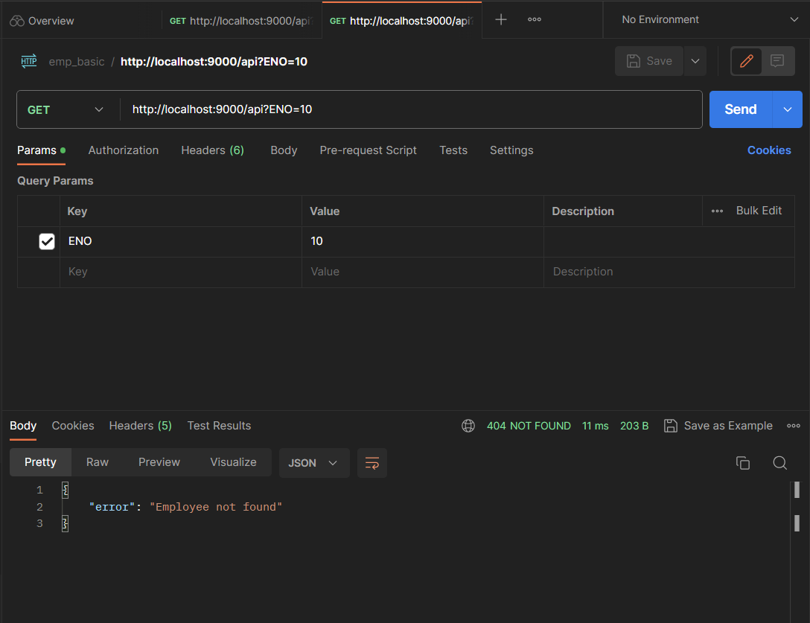
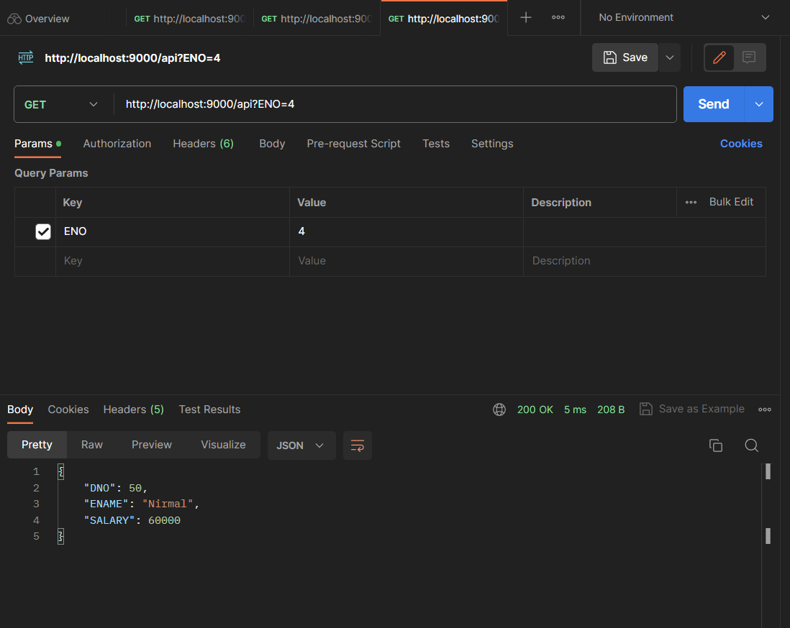
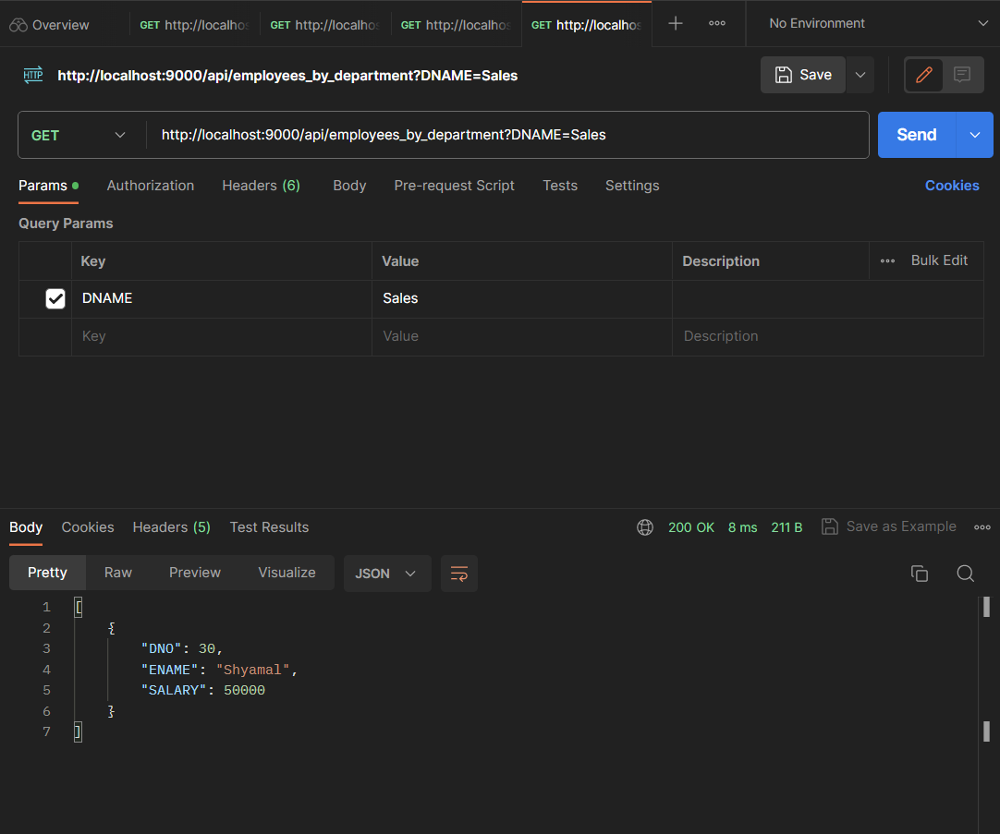
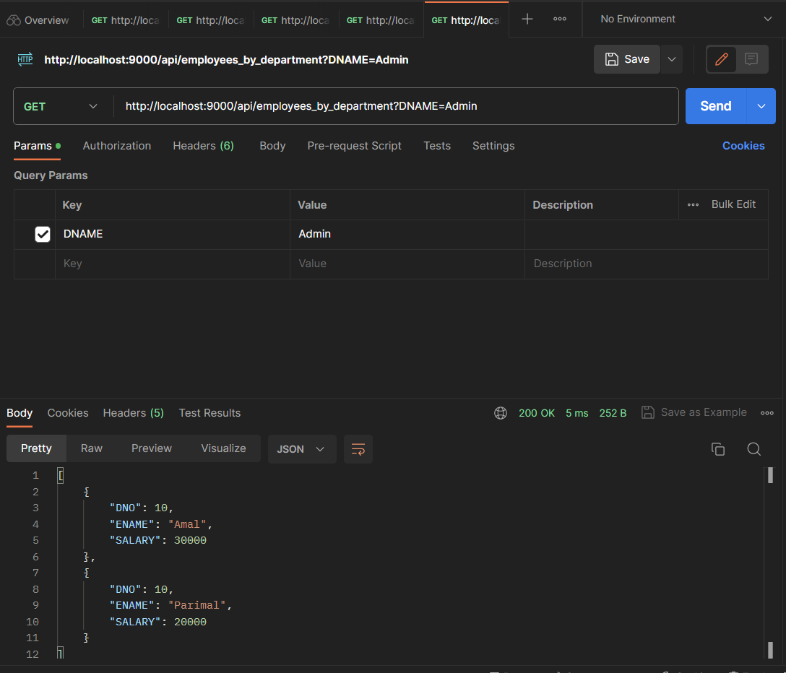

# flask_emp

Api's for emp details according to ENO and DNAME

The link to code is here [app.py](./app.py)

- Import Flask and Request Handling:

```python
from flask import Flask, request, jsonify
```

Here, we import the necessary modules from `Flask`. `Flask` is the main class we use to create our application, `request` is used to access the data sent in the HTTP request, and `jsonify` is used to convert Python dictionaries into JSON format for responses.

- Create the Flask App:

```python
app = Flask(__name__)
```

We create an instance of the Flask application. The `__name__` argument allows Flask to determine the root path for the application.

- Simulated In-Memory Database Tables:

```python
departments = { ... }
employees = { ... }
```

These dictionaries simulate the in-memory database tables. `departments` stores department numbers (`DNOs`) as keys and their corresponding department names as values. `employees` stores employee numbers (`ENOs`) as keys and their details (ENAME, DNO, SALARY) as values.

- Define APIs:

```python
@app.route('/api', methods=['GET'])
def get_employee_by_eno():
    # ... (see next step)

@app.route('/api/employees_by_department', methods=['GET'])
def get_employees_by_department():
    # ... (see next step)
```

Here, we use the `@app.route` decorator to define two API endpoints. The methods parameter specifies that these endpoints will respond only to HTTP GET requests.

- API to Get Employee by ENO:

```python

def get_employee_by_eno():
    eno = request.args.get('ENO', type=int)
    employee = employees.get(eno)
    if employee:
        return jsonify(employee)
    return jsonify({"error": "Employee not found"}), 404
```

This function `get_employee_by_eno()` is the handler for the API that returns details of an employee based on their ENO. It uses the `request.args.get` method to retrieve the `ENO` parameter from the query string. Then, it attempts to find the employee in the employees dictionary using the `ENO`. If found, it returns the employee's details as a JSON response. If not found, it returns an error message with a `404` status code.

- API to Get Employees by DNAME:

```python
def get_employees_by_department():
    dname = request.args.get('DNAME')
    department_employees = []
    for eno, employee in employees.items():
        department = departments.get(employee['DNO'])
        if department == dname:
            department_employees.append(employee)
    return jsonify(department_employees)
```

This function `get_employees_by_department()` handles the API that returns a list of employee details based on their department name. It retrieves the `DNAME` parameter from the query string and iterates through the employees dictionary. For each employee, it looks up the corresponding department name using the `DNO` and compares it with the provided `DNAME`. If they match, the employee's details are added to the department_employees list. Finally, the list is returned as a JSON response.

- Run the Flask App:

```python
if __name__ == '__main__':
    app.run(host='localhost', port=9000)
```

This block runs the Flask app only when the script is executed directly (not imported as a module). The app is set to run on `localhost` at port `9000`.

Here are some examples:

The JSON file for the below requests are here : [emp_json](./emp_basic.postman_collection.json)

- `ENO` not found

    

- `ENO=4`

    

- `DNAME=Sales`

    

- `DNAME=Admin`

    
